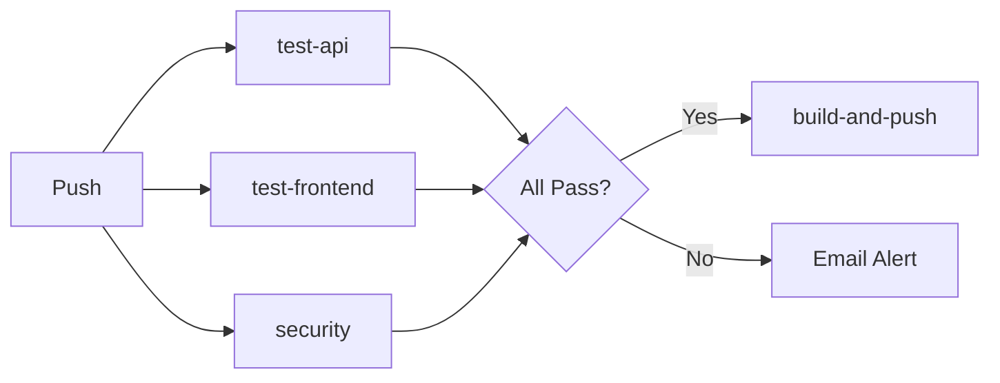

# Jasri Cozy Space 🚀

A full-stack portfolio and content management platform with enterprise-grade DevOps infrastructure.

[](https://github.com/Jasri-Mujad/my-landing-page/actions)

## 🌐 Live Demo

- **Website:** https://jasricozyspace.com
- **API:** https://api.jasricozyspace.com

---

## 🏗️ Architecture

```
┌─────────────────────────────────────────────────────────────────┐
│                        Cloudflare Tunnel                        │
└───────────────────────────┬─────────────────────────────────────┘
                            │
┌───────────────────────────▼─────────────────────────────────────┐
│                     Docker Compose Stack                         │
│  ┌──────────────┐  ┌──────────────┐  ┌────────────────────────┐ │
│  │   Frontend   │  │     API      │  │       MongoDB          │ │
│  │  (React/Vite)│  │  (Express.js)│  │                        │ │
│  │    :80       │  │    :5000     │  │        :27017          │ │
│  └──────────────┘  └──────────────┘  └────────────────────────┘ │
│  ┌──────────────┐  ┌──────────────┐  ┌────────────────────────┐ │
│  │  Prometheus  │  │   Grafana    │  │     Uptime Kuma        │ │
│  │    :9090     │  │    :3001     │  │        :3002           │ │
│  └──────────────┘  └──────────────┘  └────────────────────────┘ │
└─────────────────────────────────────────────────────────────────┘
```

---

## 🛠️ Tech Stack

| Layer | Technology |
|-------|------------|
| **Frontend** | React 19, Vite, TypeScript, Tailwind CSS |
| **Backend** | Node.js, Express.js, MongoDB, Mongoose |
| **Infrastructure** | Docker, Docker Compose, Terraform |
| **CI/CD** | GitHub Actions |
| **Monitoring** | Prometheus, Grafana, Uptime Kuma |
| **Security** | Trivy, JWT, bcrypt |
| **Registry** | GitHub Container Registry (ghcr.io) |
| **Tunnel** | Cloudflare Tunnel |

---

## 📁 Project Structure

```
├── apps/
│   ├── api/                 # Express.js backend
│   │   ├── src/
│   │   │   ├── models/      # Mongoose models
│   │   │   ├── routes/      # API routes
│   │   │   └── __tests__/   # Jest tests
│   │   └── Dockerfile
│   │
│   └── jasri-space/         # React frontend
│       ├── src/
│       │   ├── components/  # React components
│       │   ├── pages/       # Page components
│       │   └── __tests__/   # Vitest tests
│       └── Dockerfile
│
├── monitoring/              # Monitoring configs
│   ├── prometheus.yml
│   └── grafana-dashboard.json
│
├── scripts/                 # Utility scripts
│   └── backup.sh
│
├── terraform/               # Infrastructure as Code
│
├── .github/workflows/       # CI/CD pipelines
│   └── ci-cd.yml
│
└── docker-compose.prod.yml  # Production stack
```

---

## 🚀 Quick Start

### Prerequisites

- Node.js 20+
- Docker & Docker Compose
- MongoDB (local) or Docker

### Development

```bash
# Clone the repo
git clone https://github.com/Jasri-Mujad/my-landing-page.git
cd my-landing-page

# Start backend
cd apps/api
npm install
npm run dev

# Start frontend (new terminal)
cd apps/jasri-space
npm install
npm run dev
```

### Production Deployment

```bash
# On your server
docker compose -f docker-compose.prod.yml up -d
```

---

## 🧪 Testing

```bash
# Backend tests (Jest)
cd apps/api && npm test

# Frontend tests (Vitest)
cd apps/jasri-space && npm test
```

| Test Suite | Framework | Tests |
|------------|-----------|-------|
| API | Jest + Supertest | 10 |
| Frontend | Vitest + React Testing Library | 2 |

---

## 📊 CI/CD Pipeline



| Job | Description |
|-----|-------------|
| `test-api` | Runs Jest tests |
| `test-frontend` | Runs Vitest tests |
| `security` | Trivy vulnerability scan |
| `build-and-push` | Docker images → GHCR |
| `notify-failure` | Email on failure |

---

## 📈 Monitoring

| Service | Port | Purpose |
|---------|------|---------|
| Prometheus | 9090 | Metrics collection |
| Grafana | 3001 | Dashboards |
| Uptime Kuma | 3002 | Uptime monitoring |

### Available Metrics

- `jasri_api_http_requests_total` - Total HTTP requests
- `jasri_api_nodejs_heap_size_*` - Memory usage
- `jasri_api_nodejs_eventloop_lag_seconds` - Event loop lag

---

## 🔐 Environment Variables

### API (.env)

```env
PORT=5000
MONGODB_URI=mongodb://localhost:27017/jasri-space
JWT_SECRET=your-secret-key
```

### GitHub Secrets (for CI/CD)

| Secret | Description |
|--------|-------------|
| `SMTP_EMAIL` | Gmail for notifications |
| `SMTP_PASSWORD` | Gmail App Password |
| `NOTIFICATION_EMAIL` | Alert recipient |

---

## 🗄️ Database Backup

Run manual backup:
```bash
docker compose -f docker-compose.prod.yml run --rm mongo-backup
```

Backups are stored in the `mongo_backups` Docker volume with 7-day retention.

---

## 📝 License

MIT

---

## 👤 Author

**Jasri Mujad**

- Website: https://jasricozyspace.com
- GitHub: [@Jasri-Mujad](https://github.com/Jasri-Mujad)
